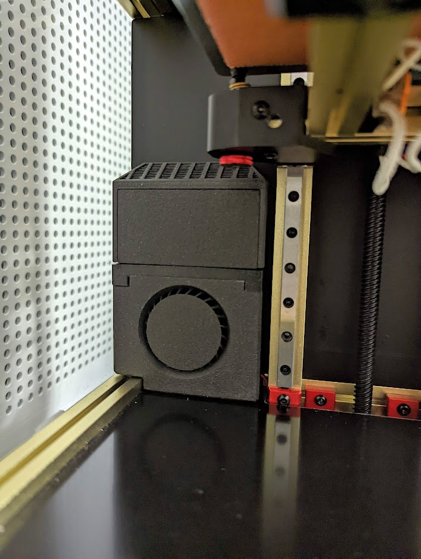
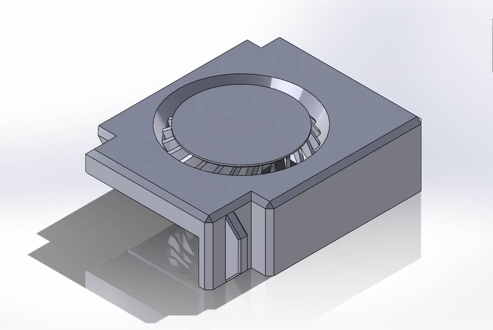
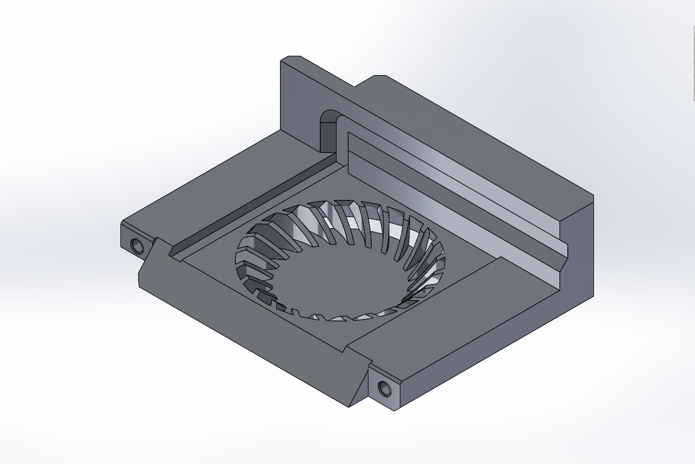

zerofilter lid for Voron v0.1 mounting
-------------

Instead of using the brace, use this lid instead to mount this into the bottom-left corner of a Voron v0.1.

Attach lid to the core with M3 screws, then press the lid into the frame extrusion.

Lid has cutout to run fan wires, which can pass through the side of the Z extrusion to the electronics compartment.

# BOM
- cartidge_lid.stl
- cartridge.stl
- core.stl (or core_beefyvent.STL for easier print with double diagonal vent thickness)
- zerofilter_voron0.1_lid.STL
- 2x M3x12mm BHCS
- M3 tap (optional)

# Model Images

