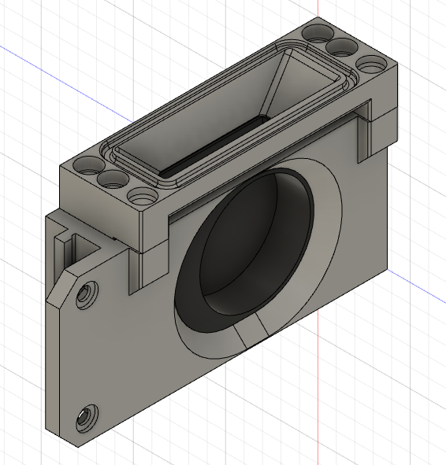
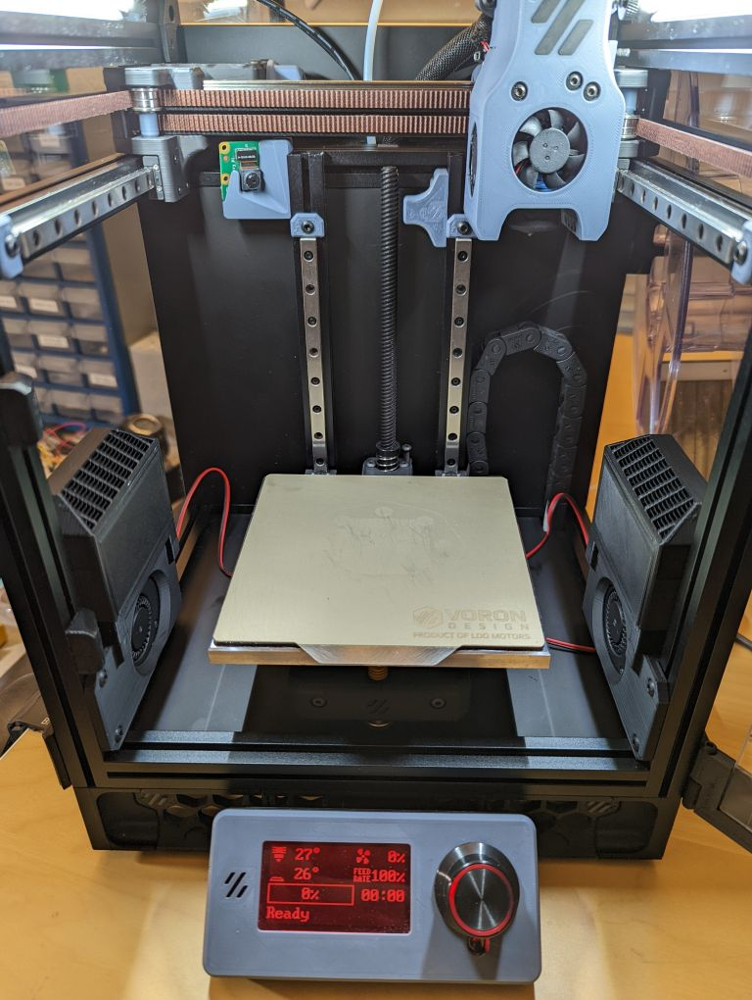
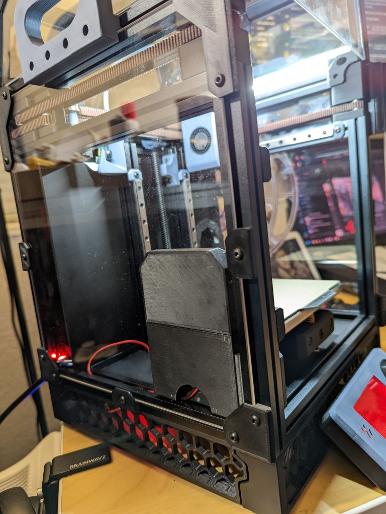

# Voron v0.1 Side Mount

---

This mod allows you to mount your Zerofilter to the inner sides of the Voron v0.1. It was partially remixed to use the great mounting design from the awesome [Side Swipe project](https://github.com/oldfar-t/Side-Swipe-Magnetic-Probe) allowing it to be installed without needing to disassemble the frame.

## Parts Needed (Per Side)

| Part | Count |
| --- | --- |
| M3 Heatset Insert | 2 |
| M3 x 12 SHCS | 2 |
| M3 x 8 BHCS | 2 |
| M3 Nut | 2 |

## Installation Pictures

