# The Zerofilter

by zruncho


### A recirculating air filter that fits in the tightest of spaces

Mounts cleanly under the bed of an [F-Zero](https://github.com/zruncho3d/f-zero), [Micron](https://github.com/hartk1213/Micron), or other smaller-volume, "zero-size" enclosed printer.

Heavily inspired by the [Nevermore series of air filters](https://github.com/nevermore3d).

Specs:

- Uses standard 4010 blower fans, without modification
- Prints easily, without supports, and no crazy overhangs
- Lid attaches quickly and securely to the cartridge, for easy filter media changes
- Cartridge snaps into place, magnetically, with a satisfying click
- Includes a gasket slot for a perfect seal between base and cartidge
- One fits in a 70mm x 97mm space; two fit in a 70mm x 194mm space
- Mounts with a provided brace and one screw, or with high-bond tape

See it in action here, in the serial request video for [F-Zero](https://github.com/zruncho3d/f-zero), a small flying-gantry printer; click the image to see the video:

[](https://youtu.be/jLSPeJ7L9R4)

## Why add this to a printer?

Go to the [Nevermore air filter](https://github.com/nevermore3d/Nevermore_Micro) page to learn more about the value of filtering VOCs (Volatile Organic Compounds) in a printer. A VOC filter should be required equipment for all printers.

They keep the stink away, whether it's from plastic, adhesives, or anything else.

They add minimal cost and print easily.

They pull heat off the heated bed and circulate air, which enables a higher chamber temperature, reached more quickly.

## Design Details

The cartridge attaches magnetically and the fan snaps in, as seen in this video:

[](https://youtu.be/ROUjoxeKX50)

The rear brace attaches to any 1515 extrusion(s), then a single screw (hidden in image below) attaches each filter base:

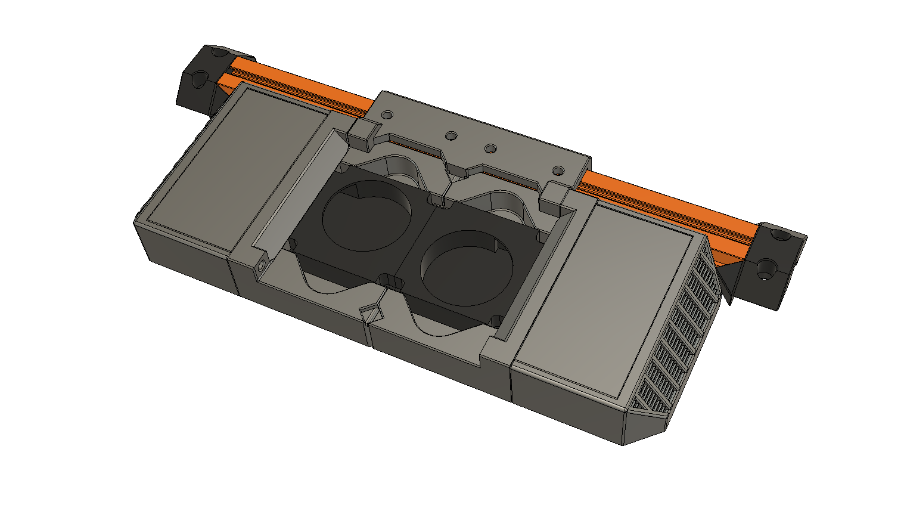

The lid attaches to the cartidge with a click - using a detent, with no magnet!

[](https://youtu.be/0voaXwZqXrY)

Here, you can see the slot for the gasket seal, which surrounds the air funnel:

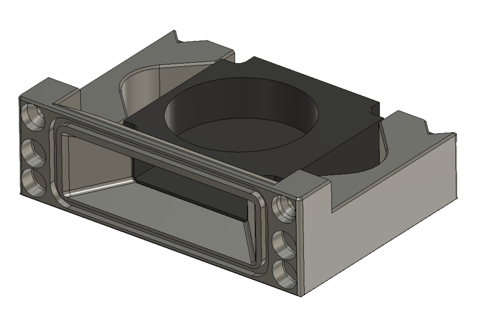

... and here, a TPU gasket is installed:

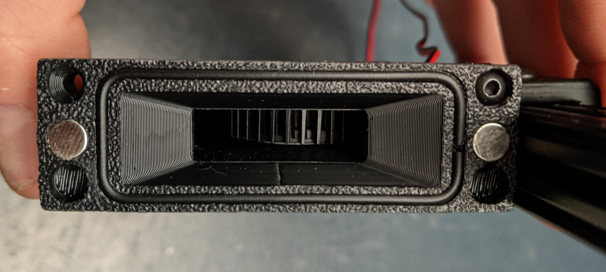

Each cartridge fits 14g of carbon; together, the 28g total fits more than a Nevermore Micro V4, which fits about 24g.


## Sample printer mounts

### Mounted to F-Zero

The 70mm size easily fits within the bed space, and the 194mm length provides 3mm on each edge to rotate and remove the cartridge.

In the picture below, 13.5mm spacers atop 15mm extrusions were used. The 28.5mm height to the bottom of the bed provides enough space for the 22mm height of the filter, but only if the M5 screw for the thermal fuse is not attached. Instead, you can use RTV Silicone high-temp gasket sealant to attach the thermal fuse in front.

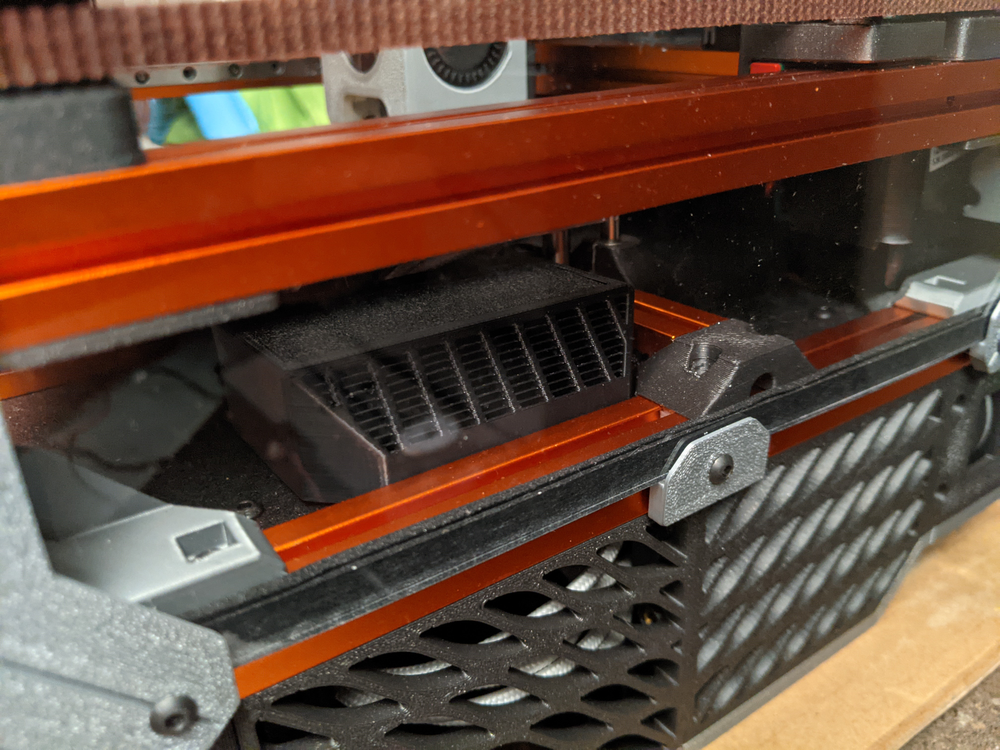
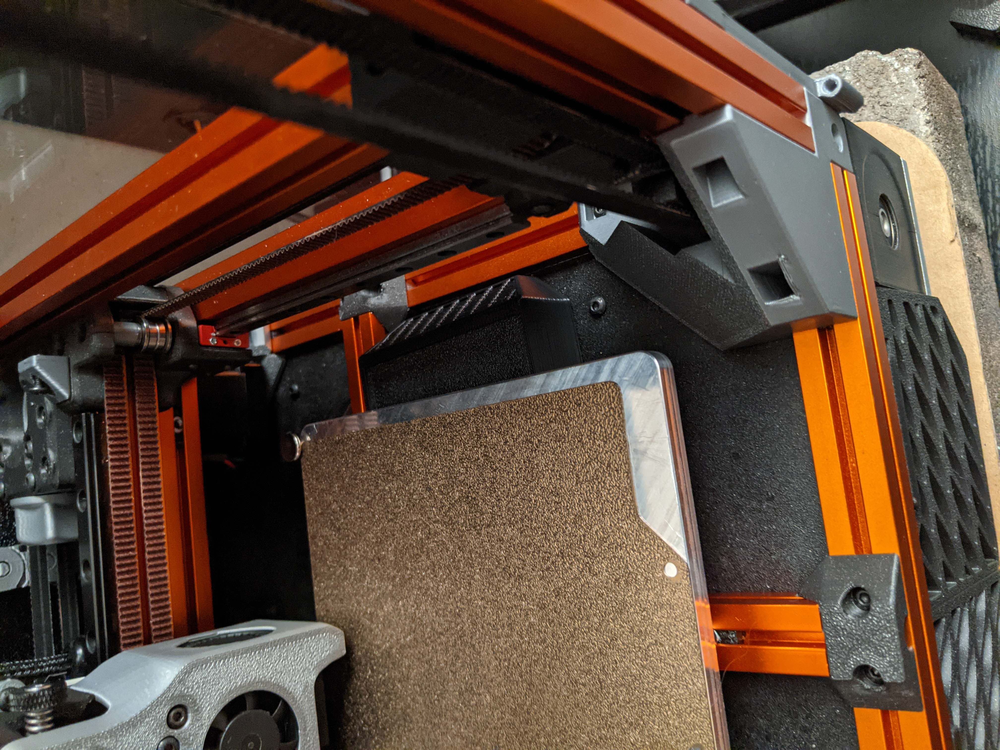

Back-side view:
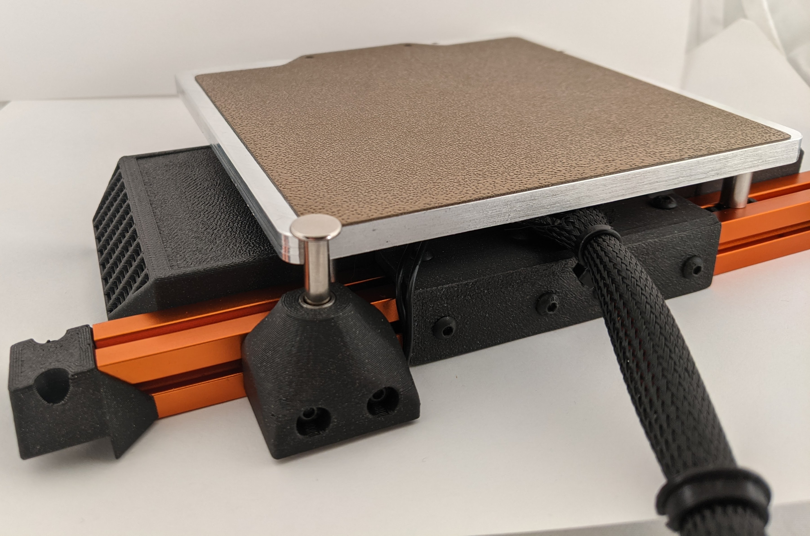

Bottom view:
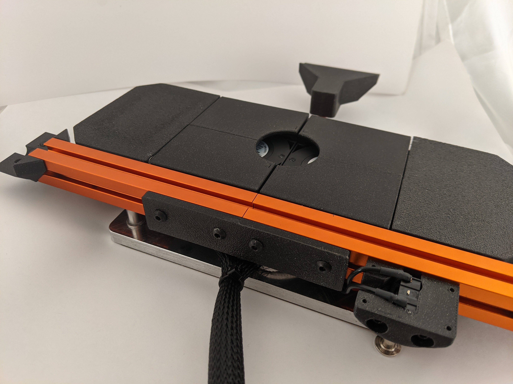

### Mounted on Micron

The 70mm between-rails width gives plenty of space.

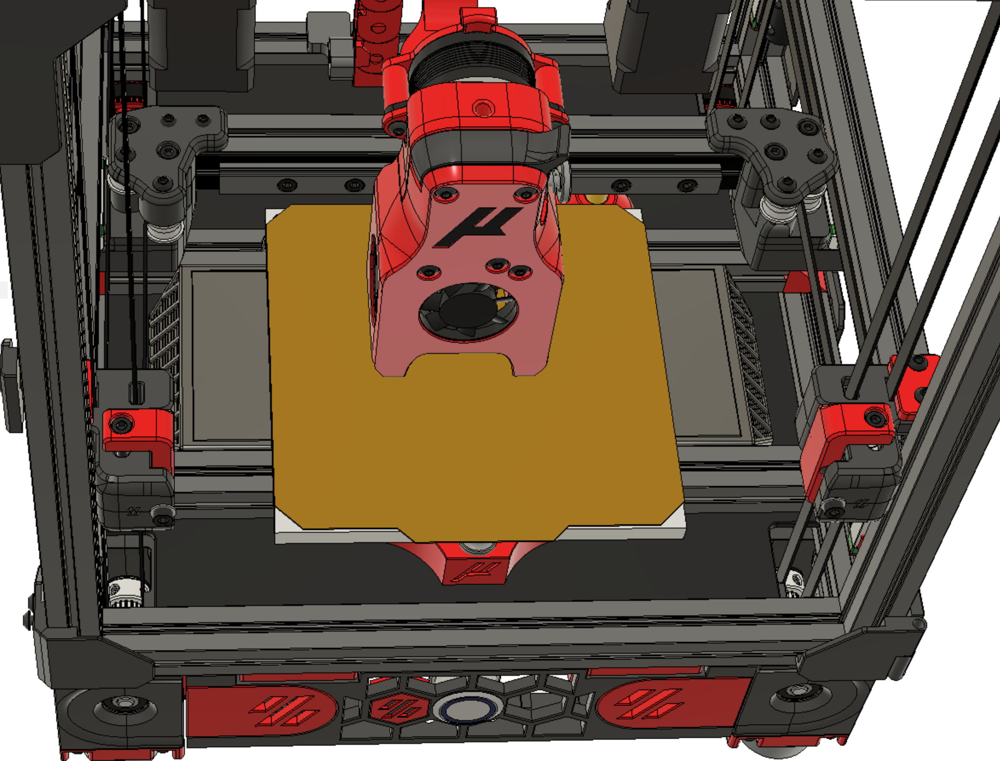
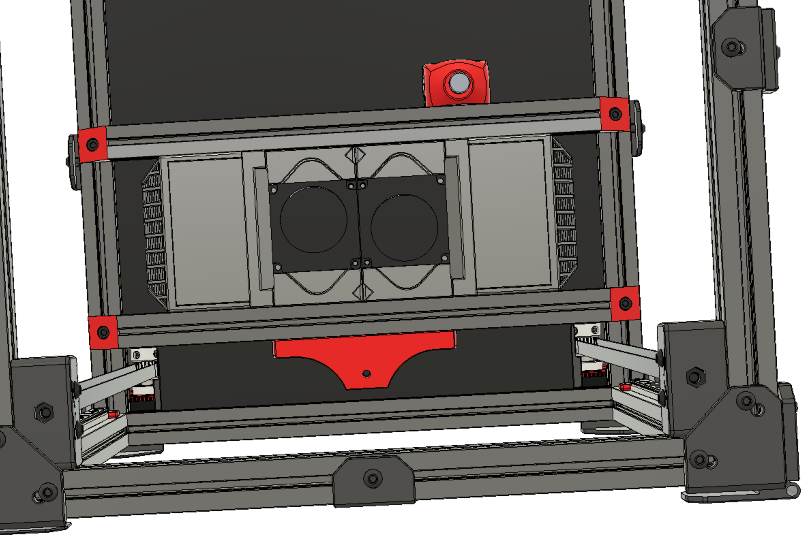
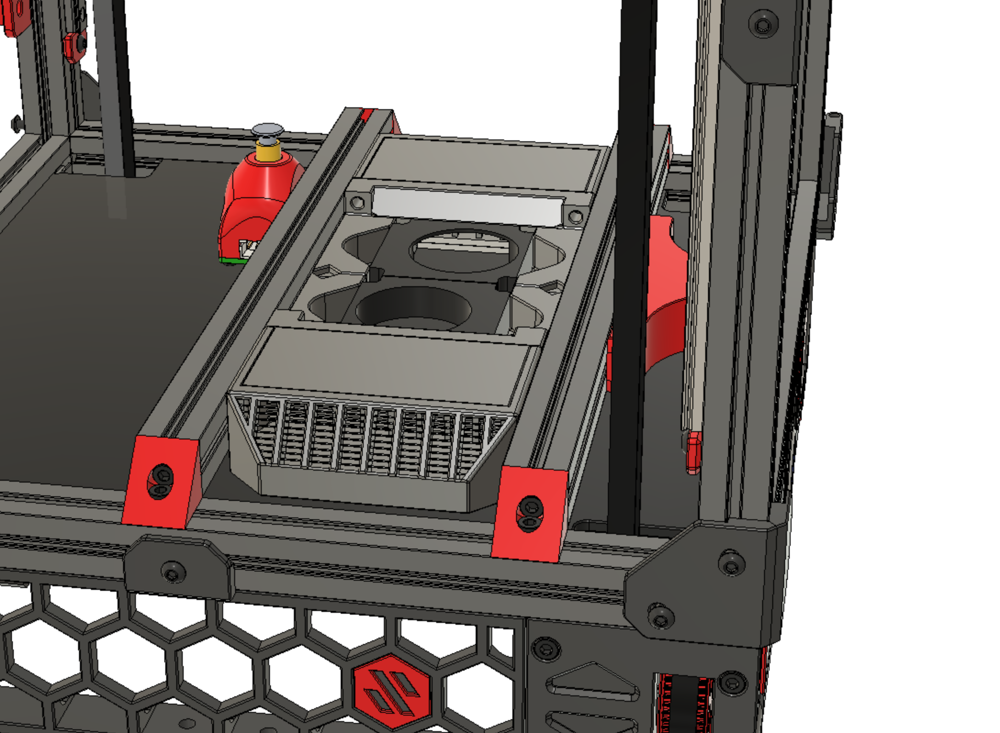

TODO: XL cartidge and lid for Micron, with 10mm extra length.

# Parts to Print

For each base + cartridge unit, you'll need to print:

- `base.stl`
- `cartridge.stl`
- `cartridge_lid.stl`

To mount to a 1515 extrusion and join together two shorter extrusions, like on F-Zero, you'll need to print `rear_brace.stl`.

This same part should work on the back bed extrusion of a Micron, but not the front. Two braces would definitely support a more secure mount, but you'd need to modify the rear brace to be smaller to not conflict with the front bed mount of a Micron.

# Parts to Acquire

For each base + cartridge unit, you'll need to acquire:

- 4010 blower fan. Basic ones seem to work, as long as they PWM, like cheap GDSTime fans. You pick the voltage; make sure it matches your printer power supply.
- Either 4 or 8 magnets, 6mm diameter by 3mm. 4 are fine (2 base + 2 cartridge) but there is space to use 8 if you really want them to grip. [Amazon link for magnets](https://www.amazon.com/dp/B077K364Z7?psc=1&ref=ppx_pop_dt_b_product_details)
- Filter Media: Use 4mm or finer activated charcoal pellets. [Amazon link for filter media](https://www.amazon.com/gp/product/B00XNXC70W/)
- (optional) 1.75mm TPU material or a large O-ring, chopped. Silicone O-rings are more flexible.
- (if using the rear brace) 1x M3x12mm BHCS
- (if using the rear brace) 8x M3x8mm BHCS
- (if using the rear brace) 8x M3 nuts
- (if using the rear brace) 1x 4mm-deep M3 "standard Voron" heatset

# Assembly Instructions

- Press a heatset insert into each side of each rear brace.
- Put a tiny dab of glue in each magnet hole on the cartidge.
- Insert the magnets into cartridge. Press hard to ensure that they sit flat. A small clamp is a good way to get the magnets flush.
- Similarly, attach the glue and magnets to the base, making sure to get the right polarity.
- Insert the blower end of the fan into the air exit on the base, then rotate the fan until it snaps in with a click.
- Attach the rear brace screws and nuts to the extrusion.
- Attach the gasket (TPU filament or O-rings) to the base. You'll have to push a bit, but it should go in easily if the print is clear. If there is any elephant's foot from printing, go ahead and clear that off with a hobby knife.
- Click each cartridge into place.
- Wire it up and test.

## Software config

To run the filter whenever the printer is on, and then for a period of time after each print, you can set it to run above a given temperature.

Sample Klipper config:

```
  [heater_fan zerofilter_1]
  # FAN0
  pin: PB0
  heater: heater_bed
  heater_temp: 40
  fan_speed: 0.6
```

Of course, make sure to add the appropriate pin, heater, and fan settings for your environment.

## Printing Instructions

All parts should be already be in print-ready orientation, assuming the Slicer is set to put seams at the rear and to print without support. The default orientation will hide all seams.

Fairly light density settings should work fine for the main parts (base, cartridge, lid):

- 3 perimeters
- 16-40% infill
- 0.45 extrusion width
- 0.2mm layer height

For the main brace, use denser settings if you're using it to join two 1515 extrusions.

- 4+ perimeters
- at least 40% infill

# FAQ

Q: What material should I print this in?

A: If it's near a bed, definitely ABS or any other heat-resistant plastic, like CF or Nylon.

Q: What fan should I use?

A: Honestly, whatever's available in the right voltage.

Q: If I have a question, where can I get help?

A: Go to the DoomCube Discord and post your question in the #zero-filter channel.

[Join the DoomCube Discord!](https://discord.gg/FDaCMadn)

# Design History

So many prototypes!

This project started from a problem posed on the DoomCube discord - to fit a fan within the constrained bed space of a tiny enclosed printer:

<https://discord.com/channels/825469421346226226/886422332393009182/886428750428905482>

About 5 iterations later, it's in good shape. The changes were to shorten the cartridge, to make the fan snap in and out easily, to add a surface for mounting, to hold the lid securely, to fit the gasket with enough clearance for typical printers, and to reduce material usage.

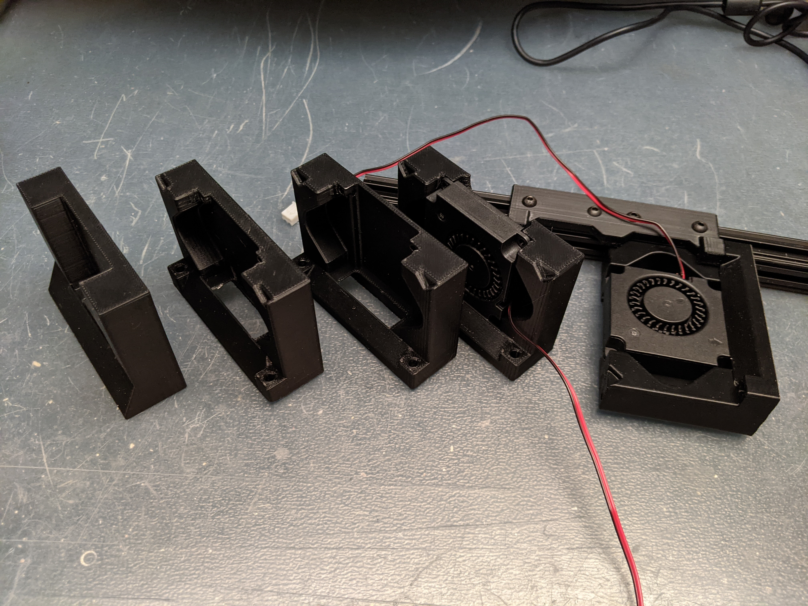

If you find this project useful, don't hesitate to reach out via Discord to zruncho#1790.
